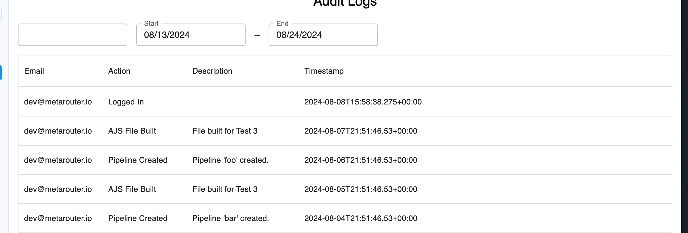

# Audit Logs Full-Stack Interview

A small app for browsing audit logs. The repo has two pieces:

- `client/` is the React + MUI frontend. It displays audit logs in a `DataGrid` with a search input.
- `server/` is the Node + Express + Prisma backend. It serves audit logs from a seeded SQLite database.

The frontend already calls the backend (`GET /api/audit-logs`). The backend currently returns every row with no filtering or sorting applied. Your job is to make it work and then extend the UI.

## Quick start

First-time setup (installs deps, runs the migration, seeds the DB):

```bash
make setup
```

Then run both servers in one terminal:

```bash
make dev          # client on :3000, server on :3001, Ctrl+C stops both
```

Or in two terminals, if you prefer separate logs:

```bash
make server       # http://localhost:3001
make client       # http://localhost:3000
```

The dev server proxies `/api/*` to `http://localhost:3001`, so the frontend talks to the backend without CORS gymnastics.

Run `make help` to see the rest of the targets (migrate, seed, reset-db, test, clean).

## Objectives

Work through these in order. The frontend objective depends on the backend supporting date range filtering.

### 1. Backend filtering and sorting

`GET /api/audit-logs` accepts these query params but ignores all of them today:

| Param           | Type                                              | Behavior                                                      |
| --------------- | ------------------------------------------------- | ------------------------------------------------------------- |
| `search`        | string                                            | Case-insensitive match on `readableAction`                    |
| `startDate`     | ISO 8601 string                                   | Inclusive lower bound on `timestamp`                          |
| `endDate`       | ISO 8601 string                                   | Inclusive upper bound on `timestamp`                          |
| `sortField`     | `timestamp` \| `action` \| `userEmail`            | Column to sort by                                             |
| `sortDirection` | `asc` \| `desc`                                   | Sort direction                                                |

Wire these up in `server/src/services/auditLogService.js`. The handler in `server/src/routes/auditLogs.js` already forwards them, so you shouldn't need to touch it. The Prisma schema lives in `server/prisma/schema.prisma`.

A few things we'll be looking at:

- Input validation. What happens when `sortField` is `"; DROP TABLE audit_logs"`?
- Whether sorting and filtering happen in the database or in JS after the fact.
- Tests. There's no test runner wired up. Pick one (`node --test`, vitest, jest, whatever) and write some.

### 2. Frontend DateTimeRangePicker

Add MUI's `DateTimeRangePicker` next to the search box on the audit logs page. Picking a range should filter the table by hitting the `startDate` and `endDate` params from step 1.



The hook at `client/src/api/useQueryAuditLogs.js` already accepts a `dateRange` arg and forwards it to the API. You just need to plumb the picker's value into it.

### 3. Refactor

There's a lot of tech debt at MR. The code in this example was built in a similarly messy way. How would you clean things up? Apply your approach to both `client/` and `server/`.
